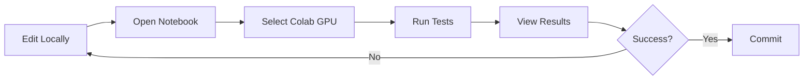

# Using VS Code Google Colab Extension

Complete guide for using the Google Colab extension in VS Code to test your CUDA code.

---

## 🎯 What This Does

The VS Code Google Colab extension allows you to:
- Open and edit `.ipynb` notebooks in VS Code
- Execute cells directly on Google Colab GPUs
- View outputs without leaving VS Code
- Leverage Colab's free GPU resources

**Note:** This is different from SSH connection - you work with notebooks, not full filesystem access.

---

## 📦 Setup

### 1. Verify Extension Installation

Press `Cmd+Shift+X` and search for "Google Colab" to confirm installation.

### 2. Sign in to Google Account

- Click the account icon in VS Code (bottom left)
- Select "Sign in to use Google Colab"
- Authorize VS Code to access your Google account

---

## 🚀 Quick Start

### Method 1: Open Existing Notebook

1. **Open a notebook in VS Code:**
   ```
   File → Open → Test_CUDA_Kernels_Colab.ipynb
   ```

2. **Select Colab Kernel:**
   - Click on kernel picker (top right)
   - Select: "Google Colab"
   - Choose GPU runtime when prompted

3. **Run cells:**
   - Click ▶️ button next to each cell
   - Or use `Shift+Enter` to run current cell

### Method 2: Create New Notebook

1. `Cmd+Shift+P` → "Create: New Jupyter Notebook"
2. Click kernel picker → "Google Colab"
3. Start coding!

---

## 📓 Test Your CUDA Code

### Option A: Use Provided Test Notebooks

I've created two test notebooks for you:

#### **1. Test_CUDA_Kernels_Colab.ipynb** (Comprehensive)
- Full build and test suite
- Tests all CUDA kernels
- Performance benchmarking
- Complete validation

**To use:**
```bash
# In VS Code:
1. Open: Test_CUDA_Kernels_Colab.ipynb
2. Select kernel: Google Colab (GPU)
3. Run all cells: Click "Run All" or Cmd+Shift+Enter
```

#### **2. Quick_CUDA_Test_Colab.ipynb** (Fast)
- Quick individual kernel testing
- Interactive kernel selection
- Source code viewer
- Fast iteration

**To use:**
```bash
# In VS Code:
1. Open: Quick_CUDA_Test_Colab.ipynb
2. Select kernel: Google Colab (GPU)
3. Run cells sequentially
4. Use dropdown to select specific kernels
```

---

## 🔧 Working with Your Code

### Test Individual CUDA Files

Create a new cell in either notebook:

```python
# Test a specific kernel
!nvcc -c CUDA_KERNELS/Boundary_Conditions_Cuda_Kernels.cu \
      -I./include -I./CUDA_KERNELS \
      -arch=sm_75 -std=c++17 --expt-relaxed-constexpr

# Check for errors
!echo "Exit code: $?"
```

### Build and Run

```python
# Quick build
%cd /content/CFD_Solver_withCUDA/build
!cmake .. -DCMAKE_BUILD_TYPE=Release
!make -j$(nproc)

# Run solver
!./CFD_solver_gpu ../json_Files/Solver_Config.json
```

### Monitor GPU

```python
# Real-time monitoring
!watch -n 1 nvidia-smi

# Or get specific info
!nvidia-smi --query-gpu=utilization.gpu,memory.used,temperature.gpu \
            --format=csv -l 1
```

---

## 💡 Best Practices

### 1. Enable GPU Runtime

Always ensure GPU is enabled:
- Click "Runtime Type" in notebook toolbar
- Select: "T4 GPU" or better
- Save

### 2. Structure Your Notebooks

Organize cells logically:
```
1. Setup (dependencies, git clone)
2. Configuration
3. Build
4. Tests
5. Cleanup
```

### 3. Save Work Frequently

- Notebooks auto-save to Google Drive
- Use version control: commit to GitHub regularly
- Export important outputs before closing

### 4. Handle Long Operations

```python
import time
from IPython.display import clear_output

# For long builds, show progress
for i in range(100):
    clear_output(wait=True)
    print(f"Building... {i+1}%")
    time.sleep(0.1)
```

---

## 🎨 VS Code Features with Colab

### Variable Explorer
- Click "Variables" button at top of notebook
- Inspect Python variables in real-time
- Great for debugging

### Outline View
- See all cells in outline
- Jump to specific cells quickly
- Navigate large notebooks easily

### IntelliSense
- Get code completion in cells
- Works with Python, bash commands
- Hover for documentation

### Diff View
- Compare notebook versions
- See changes before committing
- Right-click notebook → "Compare with..."

---

## 📊 Testing Workflow

### Recommended Workflow:



### Step-by-Step:

1. **Edit code locally in VS Code**
   - Work on `.cu` files
   - No Colab connection needed

2. **Open test notebook**
   - `Test_CUDA_Kernels_Colab.ipynb`
   - Connect to Colab

3. **Run cells to:**
   - Clone latest from GitHub
   - Build on Colab GPU
   - Run tests
   - Collect results

4. **Iterate based on results**
   - Fix issues locally
   - Commit and push
   - Re-run notebook

---

## 🐛 Troubleshooting

### Issue: "No kernel available"

**Solution:**
```
1. Reload window: Cmd+Shift+P → "Reload Window"
2. Sign out and back in to Google
3. Check internet connection
```

### Issue: "GPU not found"

**Solution:**
- Change runtime type in notebook
- Select T4 GPU or better
- Free tier may have limited GPU availability

### Issue: "Repository not found"

Make sure your repo is public or you're authenticated:
```python
# Use personal access token
!git clone https://TOKEN@github.com/rameshkolluru43/CFD_Solver_withCUDA.git
```

### Issue: "Build fails"

Check dependencies:
```python
# Re-install dependencies
!apt-get update
!apt-get install -y cmake libjsoncpp-dev libvtk9-dev
```

### Issue: "Notebook won't connect"

Clear and restart:
```python
# In notebook cell:
!kill -9 -1  # Kill all processes
# Then: Runtime → Restart Runtime
```

---

## 📈 Performance Tips

### 1. Optimize Cell Execution

```python
# Bad: Multiple small operations
!ls
!pwd
!echo "hello"

# Good: Combine operations
!ls && pwd && echo "hello"
```

### 2. Cache Builds

```python
# Use ccache to speed up rebuilds
!apt-get install -y ccache
!export PATH=/usr/lib/ccache:$PATH
!cd build && make -j$(nproc)
```

### 3. Parallel Compilation

```python
# Use all cores
!make -j$(nproc)  # Good

# Not optimal
!make  # Uses only 1 core
```

### 4. Monitor Resource Usage

```python
# Check memory before large operations
!free -h

# Check disk space
!df -h

# CPU/GPU info
!htop  # CPU
!nvidia-smi  # GPU
```

---

## 🔄 Syncing Changes

### From Local to Colab

```python
# In notebook cell:
%cd CFD_Solver_withCUDA
!git pull origin main
```

### From Colab to Local

In VS Code terminal (local):
```bash
git pull origin main
```

### Make Changes on Colab

```python
# Edit files in notebook
%%writefile CUDA_KERNELS/test.cu
// Your CUDA code here

# Commit from notebook
!git add .
!git commit -m "Test changes from Colab"
!git push
```

---

## 📋 Quick Reference

### Essential Notebook Commands

```python
# System info
!nvidia-smi                    # GPU info
!nvcc --version               # CUDA version
!cat /proc/cpuinfo            # CPU info
!free -h                      # Memory

# File operations
%cd /path/to/dir              # Change directory
!pwd                          # Print working directory
!ls -lah                      # List files
!cat file.txt                 # View file

# Git operations
!git clone <repo>             # Clone
!git pull                     # Update
!git status                   # Check status
!git add .                    # Stage all
!git commit -m "msg"          # Commit
!git push                     # Push

# Build operations
!cmake ..                     # Configure
!make -j$(nproc)             # Build
!make clean                   # Clean
```

### Magic Commands

```python
%time cmd                     # Time a command
%%time                        # Time entire cell
%lsmagic                      # List all magics
%env VAR=value               # Set environment variable
%who                         # List variables
%%writefile file.txt         # Write cell to file
```

---

## 🎯 Example Testing Session

Here's a complete testing session:

```python
# Cell 1: Setup
!nvidia-smi
!git clone https://github.com/rameshkolluru43/CFD_Solver_withCUDA.git
%cd CFD_Solver_withCUDA

# Cell 2: Dependencies
!apt-get update -qq
!apt-get install -y cmake libjsoncpp-dev -qq

# Cell 3: Configure
!cp CMakeLists_Colab.txt CMakeLists.txt
!mkdir -p build
%cd build

# Cell 4: Build
!cmake .. -DCMAKE_BUILD_TYPE=Release
!make -j$(nproc) CFD_solver_gpu

# Cell 5: Test
!ls -lh CFD_solver_gpu
!ldd CFD_solver_gpu | grep cuda

# Cell 6: Run (if you have test data)
# !./CFD_solver_gpu ../json_Files/Test_Config.json

# Cell 7: Results
!ls -lh ../output/
```

---

## 🆘 Getting Help

### In VS Code:
- `Cmd+Shift+P` → "Help: Get Started"
- View → Output → Select "Google Colab"
- Check logs for connection issues

### In Notebook:
```python
# Check Python help
help(some_function)

# Check system logs
!dmesg | tail
!journalctl -xe
```

### Resources:
- VS Code Notebooks: https://code.visualstudio.com/docs/datascience/jupyter-notebooks
- Google Colab Docs: https://colab.research.google.com/notebooks/
- CUDA Programming Guide: https://docs.nvidia.com/cuda/

---

## ✅ Success Checklist

Before starting:
- [ ] VS Code Google Colab extension installed
- [ ] Signed in to Google account in VS Code
- [ ] Test notebooks available (Test_CUDA_Kernels_Colab.ipynb)
- [ ] Repository accessible (public or authenticated)

During testing:
- [ ] GPU runtime selected (T4 or better)
- [ ] nvidia-smi shows GPU
- [ ] nvcc available
- [ ] Dependencies installed
- [ ] Project builds successfully

After testing:
- [ ] Results saved/downloaded
- [ ] Changes committed to git
- [ ] Resources freed (Runtime → Disconnect)

---

## 🚀 Next Steps

1. **Open Test_CUDA_Kernels_Colab.ipynb in VS Code**
2. **Select Google Colab kernel with GPU**
3. **Run all cells to validate setup**
4. **Review results and iterate**

Ready to test your CUDA kernels! 🎉
