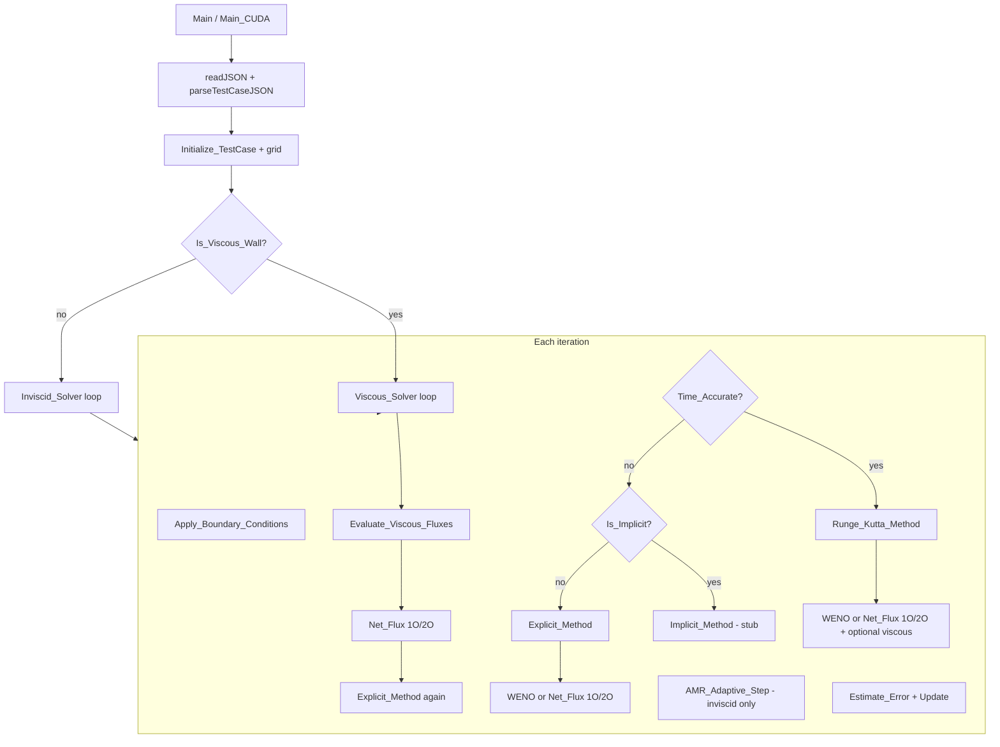

# Main Loop Implementation Status

Status of what is wired into the **primary time-marching loop** (`Main.cpp` / `Main_CUDA.cu` → `Inviscid_Solver` or `Viscous_Solver` → per-iteration kernel).

**Last updated:** July 2026

---

## Main loop structure (per iteration)

```
Apply_Boundary_Conditions()
    ↓
[Resident GPU path, CFD_solver_gpu] → Resident_GPU_Explicit_Step()   (when init succeeds)
[Time_Accurate]      → Runge_Kutta_Method()     (3-stage TVD-RK)
[Is_Implicit_Method] → Implicit_Method()        ⚠ stub (returns immediately)
[else]               → Explicit_Method()
    ↓
[Inviscid only, Enable_AMR] → AMR_Adaptive_Step()
    ↓
Estimate_Error() → Update()   (rejects non-positive cell updates)
    ↓
Periodic I/O (error, solution, VTK)
```

### Entry dispatch

| Condition | Solver |
|-----------|--------|
| `Is_Viscous` → `Is_Viscous_Wall` | `Viscous_Solver` (Navier–Stokes) |
| else | `Inviscid_Solver` (Euler) |

**CUDA note:** `CFD_solver_gpu` shares the same driver. Prefer the **resident GPU explicit step** when available (`Resident_GPU_Explicit_*` in `Solver.cpp`); otherwise fall back to host time marching with optional CUDA 1O inviscid net-flux kernels. Validated half-cylinder WENO+RICCA NS runs use the **host** WENO path (GPU WENO kept off until bit-identical). See [overview.md](../overview.md).

**Source files:** `src/Main.cpp`, `src/Main_CUDA.cu`, `src/Solver.cpp`, `src/Numerical_Method.cpp`, `src/Net_Flux.cpp`

---

## Implemented in the main loop

### Core time stepping

| Feature | Status | Location |
|---------|--------|----------|
| Explicit Euler update | ✅ | `Explicit_Method()` — `Numerical_Method.cpp` |
| TVD Runge–Kutta (3-stage) | ✅ | `Runge_Kutta_Method()` when `Time_Accurate` |
| Global `Min_dt` (leaf cells) | ✅ | `get_Min_dt()` + `Build_Leaf_Cell_List` |
| Residual / `Update()` | ✅ | `Estimate_Error()`, `Update()` on leaf cells |
| Boundary conditions (inlet/exit/wall/symmetry) | ✅ | `Apply_Boundary_Conditions()` each iteration |

### Inviscid dissipation / flux (`Dissipation_Type`)

Selected in `Evaluate_Cell_Net_Flux_1O()` / `_2O()` via `Calculate_Flux_For_All_Faces` (`Net_Flux.cpp`):

| `Dissipation_Type` | Scheme | 1st order | 2nd order (MUSCL) |
|--------------------|--------|-----------|-------------------|
| 1 | LLF | ✅ | `LLF_2O` |
| 2 | MOVERS | ✅ | `MOVERS_2O` |
| 3 | Roe | ✅ | `ROE_2O` |
| 4 | RICCA | ✅ | `RICCA_2O` |
| 5 | MOVERS_NWSC | ✅ | `MOVERS_NWSC_2O` |
| 6 | RICCA_LLF hybrid | RICCA fallback | `RICCA_2O` fallback |

- **Convective part:** `Calculate_Face_Average_Flux` (+ MUSCL variant for 2nd order).
- **AMR:** 1st-order dissipation fallback on level-transition faces (`Dissipation_Fallback_1O` in `Net_Flux.cpp`).

### CUDA inviscid / resident path

| Item | Status |
|------|--------|
| Resident GPU explicit step (inviscid + NS) | ✅ `Resident_GPU_Explicit_Init/Step/Download/Shutdown` in `Solver.cpp` (falls back to host on failure) |
| `CFD_solver_gpu` 1st-order inviscid net flux | ✅ `Evaluate_Cell_Net_Flux_1O_CUDA()` / MOVERS–RICCA kernels |
| CUDA LLF (`Dissipation_Type=1`) | ✅ |
| CUDA MOVERS (`Dissipation_Type=2`) | ✅ |
| CUDA RICCA (`Dissipation_Type=4`) | ✅ |
| CUDA MOVERS_NWSC (`Dissipation_Type=5`) | ✅ |
| CUDA Roe (`Dissipation_Type=3`) | ⚠ Standalone kernels exist; main dispatcher falls back to CPU |
| CUDA WENO (production path) | ⚠ Kept off for validated runs until bit-identical to host |

Implementation files:

- `CUDA_KERNELS/MOVERS_RICCA_Flux_Cuda_Kernels.cu` / `MOVERS_RICCA_Flux_Cuda.h`: MOVERS/RICCA/NWSC main-loop path.
- `CUDA_KERNELS/Inviscid_Flux_Cuda_MainLoop.cu` + wrapper: generic 1O CUDA bridge.
- `src/Net_Flux.cpp`: CUDA first when `USE_CUDA`; unsupported modes → CPU.

### WENO path

| Item | Status |
|------|--------|
| `Is_WENO` → `Evaluate_Cell_Net_Flux_WENO()` | ✅ Quad cells (4 faces), **host** |
| RICCA dissipation in WENO faces | ✅ When `Dissipation_Type == 4` |
| RICCA + LLF hybrid in WENO faces | ✅ When `Dissipation_Type == 6`; pressure sensor blends RICCA toward LLF near jumps |
| Wall-face degenerate stencil | ✅ Falls back to 1O cell/ghost states (`WENO2D.cpp`) |
| Non-quad / mixed mesh | ✅ Falls back to MUSCL 1O/2O in `Explicit_Method` |
| Characteristic WENO (`Is_Char`) | ✅ In `WENO2D.cpp` when flag set |

### Viscous (Navier–Stokes path only)

| Item | Status |
|------|--------|
| `Viscous_Solver` loop | ✅ |
| `Evaluate_Viscous_Fluxes()` each iteration | ✅ Host co-volume Green–Gauss (validated NS path); CUDA integration exists |
| LBRT wall normals + corner secondary neighbours | ✅ July 2026 fix — see [MESH_AND_GRID.md](MESH_AND_GRID.md) |
| Corner diagnostics dump | ✅ `Dump_Viscous_Corner_Diagnostics` |
| Subtract `Cells_Viscous_Flux` in update | ✅ When `Is_Viscous_Wall` |
| RK stages recompute viscous flux | ✅ `Runge_Kutta_Method` |
| Wall skin friction / heat flux | ✅ Periodic + end of `Viscous_Solver` |
| Update positivity | ✅ Reject non-positive updates (no pressure floor → fake M ≫ 6) |

### AMR (inviscid loop only)

| Item | Status |
|------|--------|
| Gradient indicator + tagging | ✅ |
| Quad 1→4 split / 4→1 merge | ✅ `AMR_Adaptive_Step()` — `AMR.cpp` |
| Hook in `Inviscid_Solver` | ✅ `Enable_AMR`, `AMR_Period`, `AMR_Start_Iteration` |
| Flux on leaf set only | ✅ `Build_Leaf_Cell_List` in `Net_Flux`, `Explicit_Method` |
| VTK `AMR_Level` / `AMR_Parent` | ✅ `Create_Vtk_File.cpp` |

See also [ADAPTIVE_MESH_REFINEMENT.md](ADAPTIVE_MESH_REFINEMENT.md).

### Mesh / geometry (feeds the loop)

| Item | Status |
|------|--------|
| Structured TXT grids | ✅ |
| VTK tri/quad/mixed read | ✅ |
| Face-ordered neighbours + ghost cells | ✅ |
| Generic polygon area / inviscid `dt` | ✅ |
| JSON configuration | ✅ `Configuration_Read.cpp` |

See [MESH_AND_GRID.md](MESH_AND_GRID.md).

### I/O in loop

| Item | Status |
|------|--------|
| Error file | ✅ |
| Solution snapshots | ✅ |
| VTK grid + solution | ✅ |

---

## Partially implemented / limited

| Feature | What works | Limitation |
|---------|------------|------------|
| **Implicit** | Flag + call site | `Implicit_Method()` prints error and **returns**; implementation body is `#if 0` |
| **WENO + MOVERS** | WENO runs | MOVERS/Roe not used as face dissipation in WENO; only RICCA (`Dissipation_Type==4`) or LLF-like dissipation |
| **Viscous flux** | NS path | CPU only; **4 faces hard-coded**; not generalized for tri/mixed |
| **Viscous_Solver flow** | Runs | Double 1O flux before NS step **removed** (July 2026); still prefer host WENO+RICCA for validated half-cylinder |
| **Runge–Kutta** | 3-stage TVD | Loops `No_Physical_Cells`, not leaf-only (AMR inactive parents may be touched) |
| **WENO** | Quads | Loops all `No_Physical_Cells`, not leaf-only (same AMR caveat) |
| **CUDA flux path** | 1O LLF/MOVERS/RICCA/NWSC + resident explicit step | Validated WENO+RICCA NS remains host; MUSCL 2O / Roe dispatch / full GPU WENO not production-validated |
| **Local time stepping** | JSON flag | Partial use in RK stage 1 only |
| **Co-volume / implicit Jacobian** | Code exists | Skipped for `numFaces != 4`; not in active implicit loop |
| **Viscous time step** | Multiple cases | Full viscous `dt` for quads; inviscid fallback otherwise |

---

## Not plugged into the main loop

| Feature | Notes |
|---------|--------|
| **Van Leer flux** | `Van_Leer_Flux()` in `Van_Leer.cpp` — not called from `Net_Flux` or solvers |
| **AUSM flux** | `Ausm_Flux()` — not called from main dispatch |
| **HLLC** | CUDA kernels exist; not in CPU main loop |
| **Far-field BC** | Lists built in `Grid_Computations.cpp`; `Far_Field_Boundary_Condition()` not called from `Apply_Boundary_Conditions()` |
| **Turbulence (k–ε, k–ω)** | `Viscous_Solver_With_Turbulence` — not called from `Main.cpp` |
| **Full GPU WENO / bit-identical NS** | Resident GPU + CUDA viscous integration exist; half-cylinder validation still uses host WENO+RICCA |
| **`CUDA_Integrated_Numerical_Method.cpp`** | Duplicate flux dispatch — not in CMake GPU target |
| **`Flux_Type` JSON** | Output directory labels only; **`Dissipation_Type`** drives physics |
| **`Globals_Config.cpp`** | Referenced in CMake for CPU+VTK; file may be absent (CMake skips if missing) |

---

## Configuration → main loop

Example JSON (`Solver` section):

```json
{
  "Solver": {
    "Dissipation_Type": 2,
    "Is_MOVERS_1": false,
    "Is_Second_Order": true,
    "Is_WENO": false,
    "Is_Viscous": false,
    "Time_Accurate": false,
    "Is_Implicit_Method": false,
    "Enable_AMR": true,
    "AMR_Period": 100,
    "AMR_Start_Iteration": 200,
    "AMR_Gradient_Threshold": 0.05,
    "AMR_Max_Fraction": 0.25
  }
}
```

| Key | Effect in loop |
|-----|----------------|
| `Dissipation_Type` | 1=LLF, 2=MOVERS, 3=Roe, 4=RICCA, 5=MOVERS_NWSC |
| `Is_Viscous` | `true` → `Viscous_Solver`; `false` → `Inviscid_Solver` |
| `Is_Second_Order` | `Evaluate_Cell_Net_Flux_2O` vs `_1O` |
| `Is_WENO` | WENO on all-quad meshes; else MUSCL path |
| `Time_Accurate` | `Runge_Kutta_Method` vs `Explicit_Method` |
| `Is_Implicit_Method` | Calls stub `Implicit_Method()` |
| `Enable_AMR` | `AMR_Adaptive_Step()` in `Inviscid_Solver` only |

Full reference: [CONFIGURATION.md](CONFIGURATION.md).

---

## Call flow diagram



---

## Recommended next steps (main loop)

1. **Implicit** — Implement or hard-disable `Is_Implicit_Method` with a clear runtime error.
2. **GPU WENO parity** — Enable GPU WENO only after bit-identical agreement with host on half-cylinder M=6.
3. **Van Leer / AUSM** — Add `Dissipation_Type` entries or alternate flux dispatch.
4. **Far-field BC** — Invoke `Far_Field_Boundary_Condition` from `Apply_Boundary_Conditions` when `Enable_Far_Field`.
5. **WENO + MOVERS** — Extend `Calculate_Face_WENO_Flux` for `Dissipation_Type` 2, 3, 5.
6. **Viscous on mixed meshes** — Generalize `Evaluate_Viscous_Fluxes` beyond four faces.
7. **AMR + RK/WENO** — Use `Build_Leaf_Cell_List` in RK and WENO loops.
8. **Turbulence** — Route `Viscous_Solver_With_Turbulence` from `runSolver()` when enabled in JSON.
9. **Longer viscous continue** — Extend beyond smoke500 toward heat-flux / skin-friction reporting on 481×161.

---

## Related documentation

| Document | Topic |
|----------|--------|
| [HALF_CYLINDER_VALIDATION.md](HALF_CYLINDER_VALIDATION.md) | M=6 half-cylinder configs, plots, expected Pmax/Mmax |
| [CONFIGURATION.md](CONFIGURATION.md) | JSON parameters |
| [MESH_AND_GRID.md](MESH_AND_GRID.md) | Mesh formats, LBRT, connectivity |
| [ADAPTIVE_MESH_REFINEMENT.md](ADAPTIVE_MESH_REFINEMENT.md) | AMR indicator and tagging |
| [BUILD_AND_RUN.md](BUILD_AND_RUN.md) | Build and run |
| [RELEASE_NOTES.md](RELEASE_NOTES.md) | Changelog |
| [../overview.md](../overview.md) | Project overview |
| [README.md](README.md) | Documentation index |
